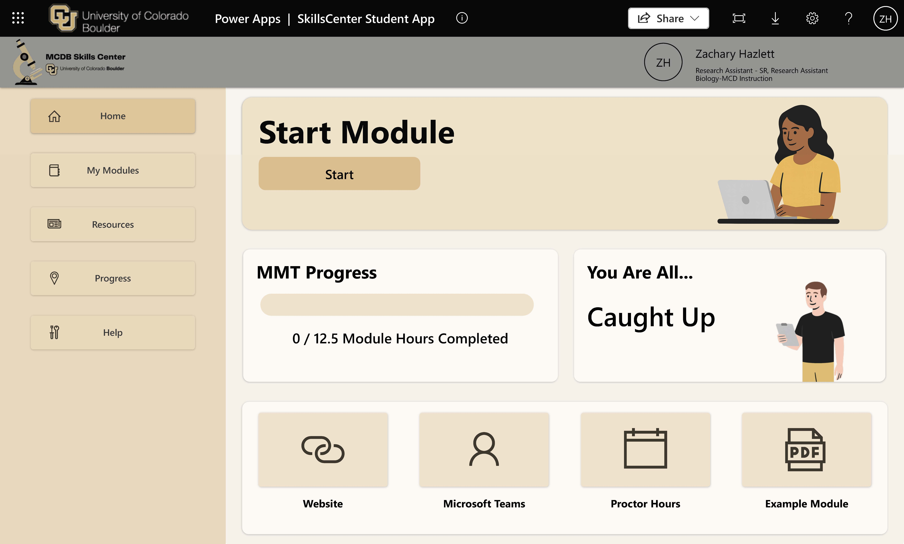

# SkillsCenter LMS

SkillsCenter LMS is a Power Apps and Power Automate solution for managing mastery based work in higher education laboratory courses. It tracks student enrollment, module submissions, grading, earned hours, feedback, milestones, and certificates.

This repository is intended to help another institution:

1. Understand the solution's architecture and security model.
2. Install the existing release in its own Microsoft 365 environment.
3. Adapt the apps, flows, lists, and course terminology for local use.

The current release contains the installable Power Platform Solution ZIP. The certificate and enrollment templates referenced below must also be added to the repository or created by the adopting institution.

> **Important:** This is a reference implementation, not a one click deployment. SharePoint sites, lists, libraries, permissions, institutional enrollment data, and template files must be prepared before or during installation.

## Contents

- [Intended Use](#intended-use)
- [Application Capabilities](#application-capabilities)
- [Roles and Access](#roles-and-access)
- [Core Workflows](#core-workflows)
- [Terminology](#terminology)
- [Architecture](#architecture)
- [Prerequisites](#prerequisites)
- [SharePoint Provisioning](#sharepoint-provisioning)
- [Enrollment Workbook](#enrollment-workbook)
- [Template Files](#template-files)
- [Environment Variables](#environment-variables)
- [Connection References](#connection-references)
- [Importing the Solution](#importing-the-solution)
- [Post Import Configuration](#post-import-configuration)
- [Smoke Tests](#smoke-tests)
- [Troubleshooting](#troubleshooting)
- [Customization Notes](#customization-notes)

---

## Intended Use

The SkillsCenter LMS was developed for higher education laboratory courses in which students complete modules, submit work, receive feedback from proctors or graders, and accumulate module hours or credit.

The solution can be customized, but adopters should first install and test the released configuration. Changes to SharePoint column names, data types, app formulas, flow actions, file paths, or identity matching logic may require coordinated changes across multiple components.

This solution is not a replacement for an institution's official student information system or learning management system. It was created for customized education under the SkillsCenter framework. Institutional enrollment data must be exported or transformed into the workbook structure described in this guide and there is currently no support for automated syncing of students with other platforms.

## Application Capabilities

### Student App

The Student App allows an authenticated student to:

- View module hour progress, milestones, and a calculated course grade.
- Browse modules by in progress, completed, and all module views.
- Explore a visual prerequisite map with locked, available, in progress, revision, and completed states.
- Add available modules to a plan and compare planned hours with required hours.
- Open a module's SOP, submission template, example, virtual lab, or podcast when configured.
- Submit one DOCX file for grading.
- Review the most recent rubric result and written feedback.
- Open a previous submission and resubmit work marked `Needs Revisions`.

The planning feature is local to the running app session. It helps a student explore a possible sequence and total hours but does not write the plan to SharePoint.



**Figure 1. Student App interface. Replace the image with a labeled screenshot of the student dashboard, module map, or submission view.**

### Proctor/Grader App

The Proctor/Grader App allows authorized course staff to:

- View all submissions, resubmissions, and submissions assigned to them.
- Sort and search the submission queue.
- Assign or unassign themselves as grader.
- Open the current DOCX and, when available, a prior submission.
- Open the module SOP and restricted answer key.
- Evaluate seven pass/ pass rubric criteria.
- Insert reusable feedback from `TemplateList`.
- Confirm a passing submission or reject it for revision.
- View student progress, lab meeting completion, rollover hours, current modules, completed modules, and overrides.

### Administrative Functions

Authorized administrators can access functions for:

- Opening and synchronizing the enrollment workbook.
- Editing semester configuration.
- Editing modules and visual module links.
- Previewing the module tree.
- Reviewing grades and extra credit.
- Opening the StudentSummary backup workbook.
- Viewing aggregate statistics such as attempts by module and grade distributions.

## Roles and Access

| Role | Primary access | Responsibilities |
| --- | --- | --- |
| **Student** | Student App and student facing resource site | Select modules, review resources, submit DOCX files, view feedback, resubmit, and monitor progress. |
| **Proctor/Grader** | Proctor App and restricted backend site | Claim submissions, review documents, apply the rubric, provide feedback, and confirm or reject work. |
| **Course Administrator** | Administrative screens, configuration lists, workbook, and backend site | Configure terms, sync enrollment, maintain modules and links, manage grades, and review backups/statistics. |
| **Service account** | Required backend sites, lists, libraries, workbook, and flow connections | Perform protected data operations on behalf of flows. It is not a human application role. |

Administrative authorization uses multiple layers: Power Apps sharing, SharePoint permissions, and the configured `ProctorEmails` values to define these roles.

## Core Workflows

### Student submission lifecycle

1. The signed in student is matched to an enrollment and `StudentSummary` record.
2. The student selects an available module after satisfying its prerequisites.
3. The student reviews the module resources and attaches one DOCX submission.
4. The record enters `Submitted`, then `Under Review` while being graded.
5. A proctor evaluates all seven rubric criteria and provides feedback.
6. If any criterion does not pass, the record becomes `Needs Revisions` and the student may submit another attempt.
7. When all criteria pass, the record becomes `Completed` and the module hours are awarded.

### Module prerequisite lifecycle

The solution stores prerequisite logic and visual arrows separately for the module progression students can view:

- `Modules.Prerequisites` controls whether a module is locked or available to a student.
- `ModuleLinks` controls the arrows displayed in the visual module tree.

These two sources must be maintained manually and kept synchronized. A mismatch can produce a visually connected module that does not unlock, or an unlocked module with no corresponding arrow.

## Terminology

| Term | Meaning in this project |
| --- | --- |
| **Power Apps canvas app** | A Microsoft Power Apps application. This is different than Canvas learning management system. |
| **Module** | A laboratory learning activity that students can complete for module hours. |
| **Proctor/Grader** | A course staff member who reviews submissions and provides feedback. |
| **Backend site** | The restricted SharePoint site containing student, grading, and configuration data. |
| **Service account** | A managed Microsoft 365 account used by flows to access protected backend data. |
| **MMT** | Module Methods Task, the submitted work product used to demonstrate mastery of a module. The application still uses this term even though current module configuration is stored in `Modules`. |

## Architecture
* **Canvas Apps:** Student App, Proctor/Grader App
* **Flows:** Grading, archive + certificate generation, student summary recalculation, enrollment sync, milestone logic, etc.
* **SharePoint:** Lists for configuration and data; libraries for files.
* **Environment Variables:** Site URLs, list/library names, document paths.
* **Connection References:** SharePoint, Teams, Forms, OneDrive, Excel.

## Prerequisites
* **Licensing:** Microsoft 365 Licensing (e.g., Office 365 E3) covering Power Apps and Power Automate use rights.
* **Power Platform:** Environment access (Dev/Test/Prod).
* **SharePoint:** Site Owner on the target Grader Only site (for example, ***Skills Center Proctors***).
    > **Critical:** This site must be restricted to Proctors/Staff. Students should not be members of this site.

---

## SharePoint Provisioning

### Security Architecture: Two Site Model
To maintain academic integrity and data security, we use a two site structure:

1.  **Parent Site (Student Facing):** A general site accessible to all students. This may house the link to the App, static SOPs, or general announcements.
2.  **Grader Site (Backend):** The "target site" for the lists/libraries below. Access must be restricted to Proctors/Graders only.
    * ***Note: Students should never navigate directly to this site.***

Create the following lists and libraries on the backend site. Display names can match the names below. Also verify the generated URL segment and internal column names before binding the solution.

### Required lists

| Name | Type | Purpose |
| --- | --- | --- |
| `Grades` | SharePoint list | Submission status, rubric results, feedback, and earned hours. |
| `Modules` | SharePoint list | Module configuration, prerequisite logic, visual-map layout, and resource links. |
| `StudentSummary` | SharePoint list | One current progress and grade summary per student. |
| `Admin` | SharePoint list | Semester dates, milestones, authorized proctors, and app version. |
| `ModuleLinks` | SharePoint list | Directed visual links between module records. |
| `TemplateList` | SharePoint list | Reusable grading-feedback templates. |
| `MMTList` | Legacy SharePoint list | Empty compatibility list if required during import. |

### Required libraries

| Name | Type | Purpose |
| --- | --- | --- |
| `Student Records` | SharePoint document library | Student DOCX submissions, archived attempts, and related records. |
| `Certifications` | SharePoint document library | Certificate Word template and generated certificate files. |

### Lists

#### Grades

| Field | Type or configuration |
| --- | --- |
| **Title** | Single line of text |
| **ModuleID** | Lookup to `Modules` |
| **FirstSubmissionDate** | Date and Time |
| **Status** | Choice: `Submitted`, `Under Review`, `Needs Revisions`, `Completed` |
| **Attempts** | Number |
| **Grader** | Single line of text |
| **EarnedHours** | Number |
| **ProctorComments** | Multiple lines of text |
| **LatestSubmissionLink** | Hyperlink or Picture |
| **RecentSubmissionDate** | Date and Time |
| **StudentID** | Lookup to `StudentSummary: ID`. Include the additional lookup fields **Student Name** and **Class**. |
| **SubmissionID** | Single line of text |
| **PlanningScore** | Number |
| **MethodsScore** | Number |
| **AnalysisScore** | Number |
| **ConclusionScore** | Number |
| **CitationsScore** | Number |
| **FormatScore** | Number |
| **MasteryScore** | Number |
| **StudentRecordID** | Single line of text |
| **CertificateLink** | Hyperlink or Picture |
| **RejectionHistory** | Multiple lines of text |
| **ModuleID: ModuleHours** | Additional lookup field from `Modules` |
| **Semester** | Single line of text |
| **Override** | Yes/No |

Create `StudentSummary` and `Modules` before creating the lookup columns in `Grades`.

The seven score fields represent pass/not pass rubric criteria:

| SharePoint field | Proctor App label |
| --- | --- |
| `PlanningScore` | Planning/Organization |
| `MethodsScore` | Materials/Methods |
| `AnalysisScore` | Data Analysis |
| `ConclusionScore` | Conclusion |
| `CitationsScore` | Citations |
| `FormatScore` | Format/Quality |
| `MasteryScore` | Module Methods Task |

All seven criteria must pass before the proctor confirms the record as `Completed` and module hours are awarded.

#### Modules

| Field | Type or configuration |
| --- | --- |
| **Title** | Single line of text |
| **ModuleName** | Single line of text |
| **ModuleHours** | Number |
| **Active** | Choice |
| **Description** | Multiple lines of text |
| **SOPPDF** | Single line of text |
| **VirtualLab** | Single line of text |
| **Podcast** | Single line of text |
| **Prerequisites** | Multiple lines of text |
| **X** | Number |
| **Y** | Number |
| **LabelPosition** | Choice: `Left`, `Right`, `Top`, `Bottom` |
| **Difficulty** | Choice: `Beginner`, `Intermediate`, `Advanced` |

`Prerequisites` controls the application's locking logic. The current build stores prerequisite module names in a serialized list such as `["Intro Lab Meeting"]`. Preserve the format expected by the imported app formulas unless those formulas are intentionally changed.

The visual module map uses `X`, `Y`, and `LabelPosition` for node layout and `ModuleLinks` for directed arrows. Update `Prerequisites` and `ModuleLinks` together.

Module resource links are associated with module records but are intentionally split by audience:

| Resource | Storage location | Audience |
| --- | --- | --- |
| SOP PDF | Student facing SharePoint site | Students and staff |
| MMT submission template | Student facing SharePoint site | Students and staff |
| MMT example | Student facing SharePoint site | Students and staff |
| MMT key | Restricted backend SharePoint site | Proctors/Graders only |
| Virtual lab | Restricted backend configuration/resource location | As configured by course staff |
| Podcast | Restricted backend configuration/resource location | As configured by course staff |

Confirm every imported module resource field and replace University of Colorado URLs with links in the adopting institution's sites. Never place an answer key in a location students can access.

#### StudentSummary

Create one current row per student.

| Field | Type or configuration |
| --- | --- |
| **Title** | Single line of text |
| **TotalModuleHours** | Number |
| **Student Name** | Single line of text |
| **Student Email** | Single line of text |
| **Class** | Single line of text |
| **Semester** | Single line of text |
| **Status** | Single line of text |
| **CreditHours** | Number |
| **ModulePct** | Number |
| **BiweeklyReq** | Number |
| **ParticipationPct** | Number |
| **ExtraCreditHours** | Number |
| **ExtraCreditPct** | Number |
| **FinalPct** | Number |
| **Completed** | Multiple lines of text |
| **ExpectedHours** | Number |
| **InProgress** | Multiple lines of text |
| **SubmissionDates** | Multiple lines of text |
| **ModulesBy** | Single line of text |
| **NextSubmissionDate** | Single line of text |
| **TotalModules** | Number |
| **ConversationID** | Single line of text |
| **TotalSeminars** | Number |
| **SeminarPct** | Number |
| **Multiplier** | Number |
| **LabMeeting1** | Yes/No |
| **LabMeeting2** | Yes/No |
| **LabMeeting3** | Yes/No |
| **LabMeeting4** | Yes/No |
| **RolloverHours** | Number |
| **AlreadyCompleted** | Multiple lines of text |

#### Admin

Create one row for each supported semester or special enrollment category. The default SharePoint **Title** column is renamed for display as **Semester** and acts as the configuration key. There is no `Default` row.

| Field | Type or configuration |
| --- | --- |
| **Title** (display name: **Semester**) | Single line of text; examples: `FA25`, `SP26`, `INCO`, `CE` |
| **StartDate** | Date and Time |
| **EndDate** | Date and Time |
| **Milestone1Date** through **Milestone7Date** | Date and Time; blanks allowed |
| **ProctorEmails** | Multiple lines of text |
| **AppVersion** | Number |

Students are assigned to a semester through enrollment data, and the app loads the matching Admin row for dates, milestones, instructors, and date based grading behavior.

- `INCO` represents students completing incomplete credits under special circumstances.
- `CE` represents continuing education.
- `INCO` and `CE` use grading behavior without milestones, so their milestone dates can remain blank.

The current grade weights, letter grade thresholds, extra credit rules, required hour logic, and timebased multiplier are hardcoded in Power Apps formulas and/or flows. Start and end dates come from the matching Admin row. The current user interface shows a course specific example of 70% Module Methods Tasks, 10% seminar reports, and 20% biweekly participation. Adopters must review and test these formulas before production use; changing the Admin dates alone does not make the grade model institution neutral.

#### ModuleLinks

| Field | Type or configuration |
| --- | --- |
| **Title** | Single line of text |
| **SourceId** | Lookup to `Modules: ID` |
| **TargetId** | Lookup to `Modules: ID` |

#### TemplateList

This list stores reusable feedback that proctors can select while grading.

| Field | Type or configuration |
| --- | --- |
| **Title** | Single line of text; short label shown to the proctor |
| **Template** | Multiple lines of text; feedback body |

The current templates support these placeholders:

| Field | Type or configuration |
| --- | --- |
| `{{NAME}}` | Student name |
| `{{PROCTOR}}` | Proctor name or signature |

Example:

```text
Hi {{NAME}},

Great work so far. Please see the document for comments. Please revise and resubmit.

- {{PROCTOR}}
```

#### MMTList

`MMTList` is a legacy list from an earlier implementation. Current module data belongs in `Modules`; the application may still use “MMT” to mean Module Methods Task in its user interface.

If the solution import prompts for `MMTList`, create an empty custom SharePoint list named `MMTList` and bind the legacy reference to it. The default **Title** column is sufficient unless the imported solution reports an additional dependency. Do not duplicate current module records into this list.

### Libraries

#### Student Records

Create a document library for student submissions and archive records.

| Field | Type or configuration |
| --- | --- |
| **Title** | Single line of text |
| **Description** | Multiple lines of text |
| **StudentID** | Single line of text |
| **ModuleID** | Single line of text |
| **AttemptNumber** | Number |
| **SubmissionDate** | Date and Time |
| **Status** | Choice: `Submitted`, `Under Review`, `Needs Revisions`, `Completed` |
| **DocumentType** | Choice: `Submission`, `ArchiveSnapshot`, `Certificate` |
| **GradedDate** | Date and Time |
| **ProctorComments** | Multiple lines of text |
| **Semester** | Single line of text |

Turn on versioning.

Student submissions are limited to one DOCX file per attempt. When a submission needs revision, preserve the earlier attempt so the student and proctor can review submission history; do not overwrite the only copy of the prior attempt.

#### Certifications

Create a document library for the certificate Word template. Add `StudentID`, `ModuleID`, or `CertificateDate` metadata for the Power Automate Flow to generate certifications correctly.

Turn on versioning.

## Enrollment Workbook

The enrollment synchronization flow reads an Excel Online workbook, normally `ActiveStudents.xlsx`, from a protected location accessible only to authorized course staff and the service account. Students must not receive direct access to this workbook.

The workbook is populated from the adopting institution's student information system or an approved institutional export. Because institutions use different schemas, normalize the export to the provided template rather than pointing the flow directly at an arbitrary institutional report.

### Required table

1. Create or copy `ActiveStudents.xlsx`.
2. Add the enrollment columns listed below.
3. Format the data range as an Excel table.
4. Name the table exactly `Enrollments`.
5. Store the workbook at the path configured in `SyncTable`.

The current institutional export includes these headers:

```text
Name
Email
NameCoach
Pronoun
Status
Student ID
User ID
Class Level
College
Major
Minor
Phone
FirstLast
Credit Hours
Class
Semester
INCO
```

Preserve the headers included in the repository template, even when a value is not used locally. `NameCoach`, `Pronoun`, `Class`, `Major`, `Minor`, and `Phone` values may be left blank in the current implementation.

`INCO` marks students with special circumstances who are completing credits from an incomplete course. Institutions that do not use this workflow should retain the column for compatibility and leave its values blank unless the flows have been customized.

Example values for a test student:

| Field | Example |
| --- | --- |
| Name | `Test, Beiyi` |
| Email | `bexu2173\@colorado.edu` |
| Status | `Enrolled` |
| Student ID | `100000006` |
| User ID | `bexu2173` |
| FirstLast | `Beiyi Test` |
| Credit Hours | `1` |
| Class | `3456` |
| Semester | `FA25` |
| INCO | blank |

The app derives identity from the signed in institutional account. During deployment, confirm that the identity field used by the app and retrieval flow matches the institution's `Email` or `User ID` format. Test both a matching user and a user with no enrollment row before production release.

> Do not test with real student information in a Development environment. Use clearly fictional test records.

## Template Files

### Certificate.docx

Place the certificate Word template in the Certifications library at the path configured by `CertificateFile`, for example:

```text
/Certifications/Certificate.docx
```

The flow's Word template controls and expected field names must match the uploaded document. Replacing the template with a locally branded version may require remapping fields in the certificate generation flow.

### ActiveStudents.xlsx

Place the enrollment workbook at the path configured by `SyncTable`, for example:

```text
/Documents/ActiveStudents.xlsx
```

The repository should provide generic copies of both template files. Until they are included in a release, adopters must create compatible files before testing certificate generation or enrollment synchronization.

## Environment Variables

### Lookup Configuration (Grades → StudentSummary)
After creating **StudentSummary** and **Grades** lists:
1.  In **Grades** → List settings → Create column, choose **Lookup**.
2.  Name it `StudentID`.
3.  Get information from: **StudentSummary**.
4.  In this column: **ID**.
5.  Add additional columns: check **Student Name** and **Class** (or your exact column display names).
6.  Save.
    * ***Note: If you later rename fields in StudentSummary, reopen this lookup and reselect the additional fields.***

### Variable Table
Set these during solution import (or after, in Solution → Environment Variables):

| EV Name | Example Value | Notes |
| :--- | :--- | :--- |
| **CertificateFile** | `/Certifications/Certificate.docx` | Template path inside the site. Place the certificate Word template here. |
| **CertificatePath** | `/Certifications` | Library (URL segment) |
| **StudentRecordPath** | `/Student Records` | Library (URL segment; match actual URL). Often `/Module Submissions`. |
| **SyncTable** | `/Documents/ActiveStudents.xlsx` | Excel with table `Enrollments`. |
| **Enrollments** | Site connection reference | Pick your Grader/Backend site connection (e.g., Skills Center Proctors) |
| **SkillsCenter** | Site connection reference | Site level CR if used. |
| **StudentSummary** | `StudentSummary` | List name bound via CR. |
| **Grades** | `Grades` | List name bound via CR. |
| **Modules** | `Modules` | List name bound via CR. |
| **MMTList** | `MMTList` | If used. |
| **ModuleLinks** | `ModuleLinks` | If used. |
| **TemplateList** | `TemplateList` | If used. |
| **Admin** | `Admin` | Settings list. |
| **Certifications** | `Certifications` | Library name bound via CR. |

> **Important:** Verify the library/list URL in Library/List Settings → URL. Use that in EVs (spaces often appear as `%20`).

---

## Connection References
Map these to connections in the target environment (prefer a service account):

* **SharePoint** (site level)
* **Microsoft Teams**
* **Microsoft Forms**
* **Excel Online (Business)**
* **OneDrive for Business**

All flows and apps reference these connection references. No personal connections should remain in production.

---

## Importing the Solution

### Install from the release ZIP

1. Complete SharePoint provisioning and prepare the template files.
2. Download the Solution ZIP from the applicable GitHub release, such as [v1.0.0](https\://github.com/Stowell-Lab/SkillCenter-LMS/releases/tag/v1.0.0).
3. Go to [make.powerapps.com](https\://make.powerapps.com), select the target environment, and open **Solutions**.
4. Select **Import solution** and upload the ZIP.
5. On the connection screen, sign in or select the approved target connections until all required connections show as valid.
6. Bind the site, list, library, workbook, and path environment variables to the resources created above.
7. Select **Import** and wait for completion.
8. Review the import log. Do not continue to production testing if a required component failed to import.

## Post Import Configuration

### Flows

- Turn on all current flows.
- Open each flow and inspect it for invalid connections, missing dynamic content, unresolved environment variables, or disabled actions.
- Save the flow after rebinding any connection or data source.
- Confirm that backend SharePoint and workbook actions use the intended service account connection.
- Configure sharing or run only permissions so student triggered flows use the intended embedded connections and do not require students to access the backend data sources directly.

### Power Apps canvas apps

- Open each app and resolve any invalid data sources or formulas.
- Confirm that the Student App obtains identity from the signed in account.
- Confirm that Office 365 Users resolves the expected profile fields and that displaying title or department is appropriate for the institution.
- Replace University of Colorado branding, logos, website links, Teams links, proctor hours links, example module links, and resource URLs.
- Review the hardcoded grade formulas, thresholds, required hours, extra credit rules, and date multiplier before publishing.
- Save and publish the apps.
- Share the Student App with the appropriate student group.
- Share the Proctor/Grader App only with authorized course staff.

### Permissions checklist

- [ ] **Service account:** Has the required rights on the backend SharePoint site, Student Records library, Certifications library, and enrollment workbook.
- [ ] **Proctors/Graders:** Have the staff access required by the Proctor/Grader App and operating procedures.
- [ ] **Course administrators:** Are present in the required `ProctorEmails` configuration and have both app sharing and SharePoint permissions.
- [ ] **Students:** Have access to the Student App and its callable flows but no direct access to the backend SharePoint site or enrollment workbook.
- [ ] **Student resources:** Students can open SOPs, templates, and examples but cannot open keys or protected backend resources.
- [ ] **Connections:** No production component depends on a former employee, student developer, or individual instructor account.
- [ ] **Test accounts:** A fictional enrolled student, an unenrolled user, and a proctor account are available for validation.

## Smoke Tests

Run these tests with fictional records in a nonproduction environment.

1. **Identity isolation**
   - Sign in as Test Student A.
   - Confirm the Student App returns only Student A's data.
   - Confirm changing a client side value cannot retrieve Student B's data.
   - Sign in as a user absent from `Enrollments` and confirm that no student record is disclosed.

2. **Enrollment synchronization**
   - Add a fictional row to the `Enrollments` table.
   - Run the enrollment sync.
   - Confirm the expected `StudentSummary` row is created or updated.

3. **Modules**
   - Create an active module with `ModuleHours`.
   - Confirm it appears in the appropriate app view.
   - Add a prerequisite and the matching visual link.
   - Confirm the module is locked before completion of the prerequisite and unlocks afterward.
   - Confirm the arrow shown in the module tree matches the prerequisite logic.
   - Add the module to the local plan and confirm planned hours update without creating or changing a SharePoint record.

4. **Submission and grading lifecycle**
   - Submit one fictional DOCX and confirm its initial status is `Submitted`.
   - Claim it in the Proctor App and confirm the status changes to `Under Review` when expected by the current workflow.
   - Fail at least one rubric criterion, reject the submission, and confirm `Needs Revisions` plus feedback appears in the Student App.
   - Resubmit and confirm the prior attempt remains available.
   - Pass all seven criteria, confirm the submission, and verify `Completed`, earned hours, and summary recalculation.

5. **Student Records**
   - Confirm non DOCX submissions are rejected or cannot be selected.
   - Confirm the file, metadata, attempt number, and archive behavior.

6. **Feedback templates**
   - Create a `TemplateList` row containing `{{NAME}}` and `{{PROCTOR}}`.
   - Apply it during grading and confirm both placeholders are replaced correctly.

7. **Certificates**
   - Complete the conditions that trigger certificate generation.
   - Confirm the template fields populate and the generated PDF is stored in Certifications.

8. **Milestones**
   - Set a future milestone in a standard semester Admin row and assign the fictional student to that semester.
   - Confirm the Student App displays the expected module target and date.

9. **StudentSummary backup**
   - Trigger or wait for the automatic backup process.
   - Confirm the XLSX backup contains current `StudentSummary` data and is stored in the expected protected location.

10. **Role isolation**
   - Confirm a student cannot open the Proctor App, Admin functions, MMT keys, or the backend SharePoint site.
   - Confirm a proctor can grade but receives only the administrative capabilities intended by the institution's role model.

## Troubleshooting

| Issue | Likely cause and action |
| --- | --- |
| List or library does not appear during import | Confirm that it was created on the selected backend site and that the importing account can access it. Verify the site connection, then refresh the import mapping. |
| Import requests `MMTList` | Create and select an empty custom list named `MMTList`. It is a legacy dependency; current module data belongs in `Modules`. |
| Import requests Microsoft Forms permission | Approve the legacy connector permission. No Forms data source needs to be selected for the current workflow. |
| A flow receives a 404 or path error | Compare the configured path with the actual SharePoint library URL segment. Check spaces, `%20`, leading slashes, filenames, and site selection. |
| Enrollment sync cannot find its table | Confirm that the workbook path is correct and that the Excel table is named exactly `Enrollments`. Verify that expected headers are present. |
| Enrollment sync cannot find a student | Compare the signed in identity format with the workbook's `Email` and `User ID` values. Check institutional aliases and capitalization assumptions in the flow. |
| Students receive permission errors | Verify app and flow sharing, run only configuration, and embedded service account connections. Do not solve this by granting students access to the backend site. |
| A module arrow and lock state disagree | `Modules.Prerequisites` and `ModuleLinks` are out of sync. Update the prerequisite list and the corresponding source/target visual link together. |
| A student can see an SOP but not a template or example | Verify that all student facing resource links point to files on the student accessible SharePoint site and that students have permission to those files. |
| A student can open an MMT key | Move the key to the restricted backend site, remove student permissions, and replace the module resource link. Treat this as a security configuration error. |
| User profile information is blank | Verify the Office 365 Users connection and confirm the tenant profile contains the fields used by the app. |
| The wrong term dates or instructors appear | Confirm the student's `Semester` matches the displayed **Semester**/internal `Title` value in the correct Admin row. |
| Module hours are awarded before all criteria pass | Review the confirm/reject logic. The current workflow requires all seven rubric criteria to pass before completion. |
| StudentSummary backup is missing or stale | Check the backup flow, Excel/OneDrive or SharePoint connection, destination workbook, and service-account access. |
| A flow is off after import | Resolve its connection and environment variable errors, save it, and then turn it on. |
| Feedback placeholders remain visible | Confirm the `Template` column is Multiple lines of text and the template uses exactly `{{NAME}}` and `{{PROCTOR}}`. Inspect the replacement actions in the grading flow. |
| Certificate generation fails | Confirm `Certificate.docx` exists at `CertificateFile`, the service account can access it, and its Word template controls match the flow. |

## Customization Notes

- Install and test the released schema before renaming lists or columns.
- Treat `Modules` as the current module source; do not build new functionality on `MMTList`.
- The current app still uses “MMT” to mean Module Methods Task. Adopters may rename this term, but must update labels, templates, grading screens, and documentation consistently.
- Keep `Modules.Prerequisites` synchronized manually with `ModuleLinks`.
- Module planning is local and is not a persistent academic plan.
- Keep one current row per student in `StudentSummary`. If historical terms are required, archive them separately rather than creating ambiguous duplicate current rows.
- `RolloverHours` stores a numeric balance; prior term files are not automatically moved.
- Semester dates, milestones, and proctor configuration are read from the Admin row whose displayed **Semester** value matches the student's semester. There is no `Default` row.
- `INCO` and `CE` use milestone free grading behavior in the current implementation.
- Grade weights and multiplier rules are hardcoded. Changing dates, SharePoint values, or labels does not automatically adapt the grade formulas.
- Preserve the security split between student facing resources and proctor only keys or backend materials.
- Replace institution specific enrollment exports with a normalization process that outputs the documented `Enrollments` table.
- When changing identity matching, test authorization as well as successful lookup. A valid student identifier is not sufficient unless it is tied to the authenticated user.
- Document every local change to choice values, internal column names, templates, connections, and flows so future solution upgrades can be reconciled safely.
